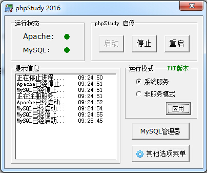
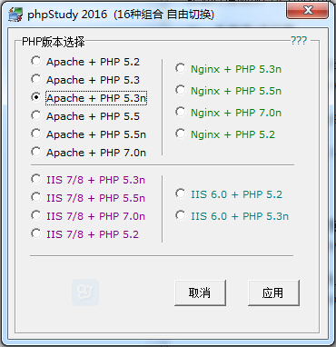
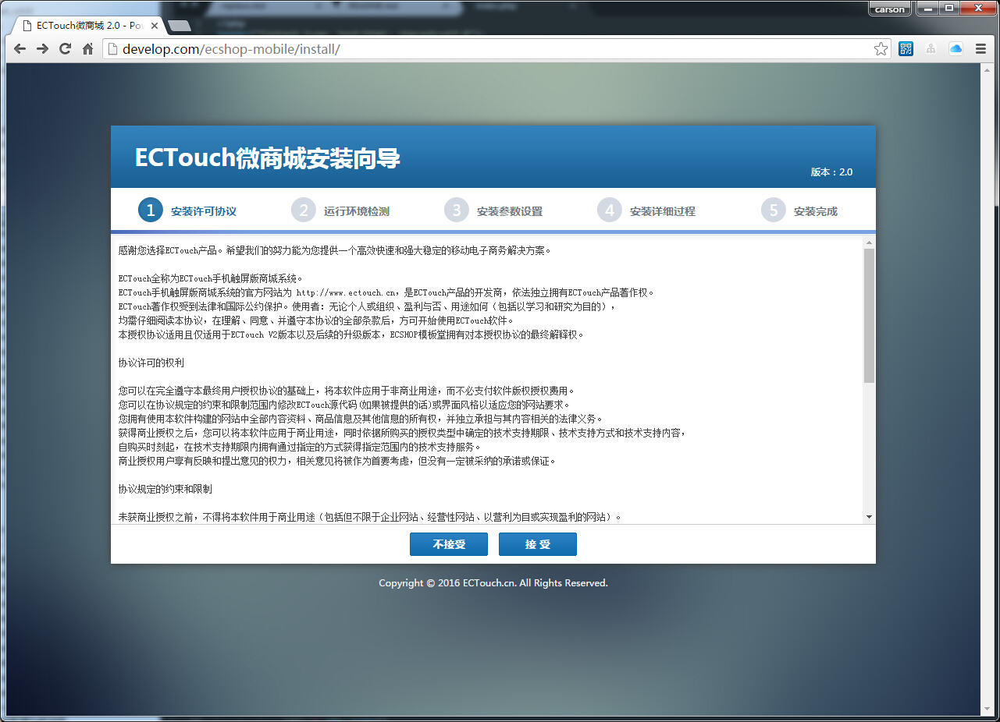
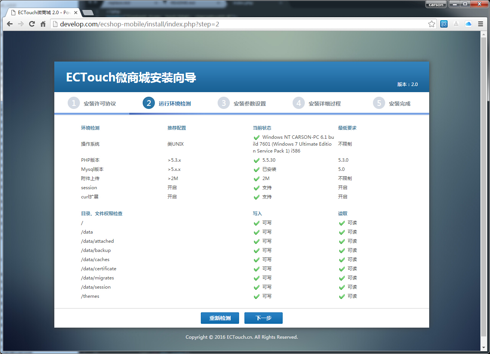
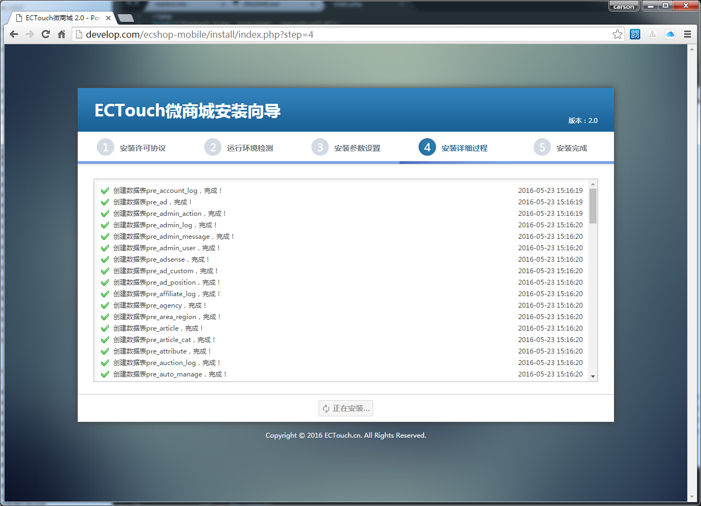
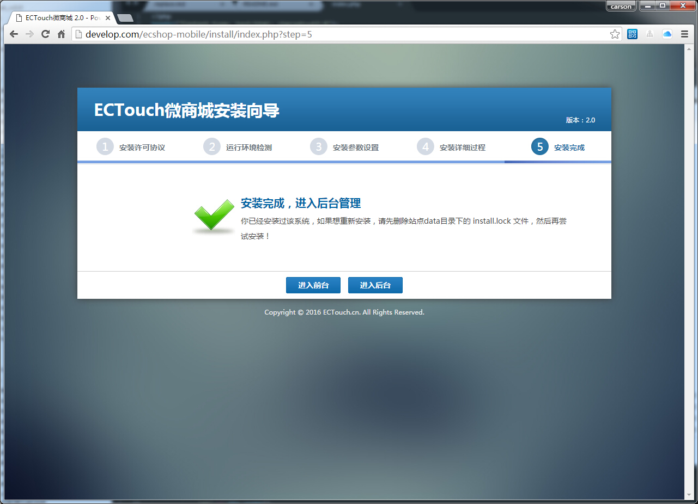

## ECTouch安装文档 ##

### 安装与环境 ###

**一、支持环境**

ECTouch基于PHP+MYSQL开发，大部分的PHP环境都能够正常运行。 
PHP版本：5.3+ 
MYSQL版本：5.1+ 
安装时请确保PHP环境中的curl库依赖的SSL版本为openssl，如果SSL版本是nss，请更换为openssl。

**二、本地集成环境**

推荐使用PHPStudy作为本地测试环境，当然也可以使用windows运营的环境，推荐使用PHP5.4版本进行测试。 
下载地址解压版：http://www.phpstudy.net/phpstudy/phpStudy.zip

1、本地解压后，启动phpStudy.exe 文件，点击主界面的“PHP版本”按钮进行版本切换。

2、选择Apache + PHP 5.3n（NTS）版本，点击应用后重启Apache。

**三、服务器部署**

ECTouch是一款以 PHP 为编程语言，以 MySQL 为数据库，并使用 Apache/IIS/Nginx（任意一种即可） 提供 web 服务的产品。要搭建 ECTouch 站点，服务器必须安装由 PHP、MySQL、Apache/IIS/Nginx 构成的环境。其中，IIS 主要用于 Windows 服务器，Apache、Nginx 多用于 Linux 服务器（即 LAMP 和 LNMP）。

**四、安装流程说明**

获取ECTouch微商城安装包，把压缩包解压后获取微商城安装文件，将本程序放置在您的环境下然后在浏览器中访问环境网址即可自动进入安装引导。

请认真阅读ECTouch微商城安装许可协议，阅读完后请点击“接受”按钮进入下一步。

系统在安装前进行一次运行环境检测，请确保所有检测项目满足系统运行条件，如果提示请处理后点击“下一步”按钮。

系统环境检测完成后，请在此页面填写数据库链接配置信息，请确保数据库链接正常。

请填写网站默认站点信息及管理员帐号信息，系统会在之后的安装过程中自动创建。

点击“创建数据”按钮后，系统会自动导入所有需要的数据库数据到mysql数据库中，请等待安装过程完成。

----------

### 安装常见问题 ###

**1. 安装的过程中提示“安装已停止”怎么办？** 
请修改mysql的配置文件my.ini，将mode中的“STRICT_TRANS_TABLES”移除，保存后重启mysql服务。

**2. 安装的过程中无法进入下一步设置数据库？** 
请在data目录下新建session目录，并设置可写权限；如果session目录已经存在，请设置可写权限即可。
